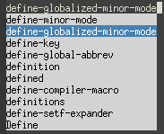

fancy-dabbrev
=============

fancy-dabbrev essentially wraps the Emacs built-in [dabbrev] functionality,
with two improvements:

1. **Preview**: If `fancy-dabbrev-mode` is enabled, a preview of the first
   expansion candidate will be shown when any text has been entered. If
   `fancy-dabbrev-expand` then is called, the candidate will be expanded.
2. **Popup menu**: The first call to `fancy-dabbrev-expand` will expand the
   entered word prefix just like `dabbrev-expand`. But the second call will
   show a popup menu with other candidates (with the second candidate
   selected). The third call will advance to the third candidate, etc. It is
   also possible to go back to a previous candidate by calling
   `fancy-dabbrev-backward`. Selection from the menu can be canceled with
   `C-g`. Any cursor movement or typing will hide the menu again.

Example
-------

After typing "defi":

After pressing TAB (assuming it is bound to `fancy-dabbrev`):

After pressing TAB a second time:

After pressing TAB a third time:

After pressing space:

Installation
------------

To load `fancy-dabbrev`, store `fancy-dabbrev.el` in your Emacs load path and
put something like this in your Emacs configuration file:

    ;; Load fancy-dabbrev.el:
    (require 'fancy-dabbrev)

    ;; Enable fancy-dabbrev previews everywhere:
    (global-fancy-dabbrev-mode)

    ;; Bind fancy-dabbrev-expand and fancy-dabbrev-backward to your keys of
    ;; choice:
    (global-set-key (kbd "TAB") 'fancy-dabbrev-expand)
    (global-set-key (kbd "<backtab>") 'fancy-dabbrev-backward)

    ;; If you want TAB to indent the line like it usually does when the cursor
    ;; is not next to an expandable word, use 'fancy-dabbrev-expand-or-indent
    ;; instead:
    (global-set-key (kbd "TAB") 'fancy-dabbrev-expand-or-indent)

Configuration
-------------

`fancy-dabbrev-expand` uses `dabbrev-expand` under the hood, so most
`dabbrev-*` configuration options affect `fancy-dabbrev-expand` as well. For
instance, if you want to use `fancy-dabbrev-expand` when programming, you
probably want to use these settings:

    ;; Let dabbrev searches ignore case and expansions preserve case:
    (setq dabbrev-case-distinction nil)
    (setq dabbrev-case-fold-search t)
    (setq dabbrev-case-replace nil)

Here are `fancy-dabbrev`'s own configuration options:

* `fancy-dabbrev-menu-height` (default: `10`)

  How many expansion candidates to show in the menu.

* `fancy-dabbrev-preview-delay` (default: `0.2`)

  How long (in seconds) to wait until displaying the preview after a keystroke.

* `fancy-dabbrev-preview-context` (default: `'at-eol`)

  When to show the preview. If `'at-eol`, only show the preview if no other
  text (except whitespace) is to the right of the cursor. If
  `'before-non-word`, show the preview whenever the cursor is not immediately
  before (or inside) a word. If `'everywhere`, always show the preview after
  typing.

* `fancy-dabbrev-no-expansion-for` (default: `'(multiple-cursors-mode)`)

  A list of variables which, if bound and non-nil, will inactivate
  `fancy-dabbrev` expansion. The variables typically represent major or minor
  modes. When inactive, `fancy-dabbrev` will fall back to running
  `dabbrev-expand`.

* `fancy-dabbrev-no-preview-for` (default:
  `'(iedit-mode isearch-mode multiple-cursors-mode)`)

  A list of variables which, if bound and non-nil, will inactivate
  `fancy-dabbrev` preview. The variables typically represent major or minor
  modes.

Why?
----

There are many other Emacs packages for doing more or less advanced
auto-completion in different ways. After trying out some of the more popular
ones and not clicking with them, I kept coming back to `dabbrev` due to its
simplicity. Since I missed the preview feature and a way of selecting
expansions candidates from a menu if the first candidate isn't the right one, I
wrote `fancy-dabbrev`.

Have fun!

/Joel Rosdahl <joel@rosdahl.net>

[dabbrev]: https://www.gnu.org/software/emacs/manual/html_node/emacs/Dynamic-Abbrevs.html
