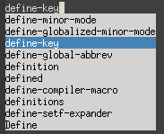

fancy-dabbrev
=============

[](https://melpa.org/#/fancy-dabbrev)

fancy-dabbrev essentially wraps the Emacs built-in [dabbrev] functionality,
with two improvements:

1. **Preview**: If `fancy-dabbrev-mode` is enabled, a preview of the first
   expansion candidate will be shown when any text has been entered. If
   `fancy-dabbrev-expand` then is called, the candidate will be expanded.
2. **Popup menu**: The first call to `fancy-dabbrev-expand` will expand the
   entered word prefix just like `dabbrev-expand`. But the second call will
   show a popup menu with other candidates (with the second candidate
   selected). The third call will advance to the third candidate, etc. It is
   also possible to go back to a previous candidate by calling
   `fancy-dabbrev-backward`. Selection from the menu can be canceled with
   `C-g`. Any cursor movement or typing will hide the menu again.


Example
-------

After typing "defi":


After pressing TAB (assuming it is bound to `fancy-dabbrev-expand`):


After pressing TAB a second time:


The menu entries are by default sorted on proximity. This can changed with the
`fancy-dabbrev-sort-menu` configuration option.

After pressing TAB a third time:



After pressing space:


Installation
------------

`fancy-dabbrev` depends on the
[popup](https://github.com/auto-complete/popup-el) package, so you need to
install that first if you don't have it already.

To load `fancy-dabbrev` itself, store `fancy-dabbrev.el` in your Emacs load
path and put something like this in your Emacs configuration file:

```elisp
;; Load fancy-dabbrev.el:
(require 'fancy-dabbrev)

;; Enable fancy-dabbrev previews everywhere:
(global-fancy-dabbrev-mode)

;; Bind fancy-dabbrev-expand and fancy-dabbrev-backward to your keys of
;; choice, here "TAB" and "Shift+TAB":
(global-set-key (kbd "TAB") 'fancy-dabbrev-expand)
(global-set-key (kbd "<backtab>") 'fancy-dabbrev-backward)

;; If you want TAB to indent the line like it usually does when the cursor
;; is not next to an expandable word, use 'fancy-dabbrev-expand-or-indent
;; instead of `fancy-dabbrev-expand`:
(global-set-key (kbd "TAB") 'fancy-dabbrev-expand-or-indent)
(global-set-key (kbd "<backtab>") 'fancy-dabbrev-backward)
```


Configuration
-------------

`fancy-dabbrev-expand` uses `dabbrev-expand` under the hood, so most
`dabbrev-*` configuration options affect `fancy-dabbrev-expand` as well. For
instance, if you want to use `fancy-dabbrev-expand` when programming, you
probably want to use these settings:


```elisp
;; Let dabbrev searches ignore case and expansions preserve case:
(setq dabbrev-case-distinction nil)
(setq dabbrev-case-fold-search t)
(setq dabbrev-case-replace nil)
```

Here are `fancy-dabbrev`'s own configuration options:

* `fancy-dabbrev-expansion-context` (default: `'after-symbol`)

  Where to try to perform expansion. If `'after-symbol`, only try to expand
  after a symbol (as determined by `thing-at-point`). If
  `'after-symbol-or-space`, also expand after a space (the first expansion
  candidate will then be based on the previous symbol). If `'after-non-space`,
  enable expansion after any non-space character. If `'almost-everywhere`,
  enable exansion everywhere except at empty lines.

* `fancy-dabbrev-expansion-on-preview-only` (default: `nil`)

  Only expand when a preview is shown or expansion ran for the last command.
  This has the advantage that fancy-dabbrev-expand-or-indent always falls back
  to calling fancy-dabbrev-indent-command when there is nothing to expand.

* `fancy-dabbrev-indent-command` (default: `'indent-for-tab-command`)

  The indentation command used for `fancy-dabbrev-expand-or-indent`.

* `fancy-dabbrev-menu-height` (default: `10`)

  How many expansion candidates to show in the menu.

* `fancy-dabbrev-no-expansion-for` (default: `'(multiple-cursors-mode)`)

  A list of variables which, if bound and non-`nil`, will inactivate
  `fancy-dabbrev` expansion. The variables typically represent major or minor
  modes. When inactive, `fancy-dabbrev-expand` will fall back to running
  `dabbrev-expand`.

* `fancy-dabbrev-no-preview-for` (default:
  `'(iedit-mode isearch-mode multiple-cursors-mode)`)

  A list of variables which, if bound and non-`nil`, will inactivate
  `fancy-dabbrev` preview. The variables typically represent major or minor
  modes.

* `fancy-dabbrev-preview-context` (default: `'at-eol`)

  When to show the preview. If `'at-eol`, only show the preview if no other
  text (except whitespace) is to the right of the cursor. If
  `'before-non-word`, show the preview whenever the cursor is not immediately
  before (or inside) a word. If `'everywhere`, always show the preview after
  typing.

* `fancy-dabbrev-preview-delay` (default: `0.0`)

  How long (in seconds) to wait until displaying the preview after a keystroke.
  Set this to e.g. `0.2` if you think that it's annoying to get a preview
  immediately after writing some text.

* `fancy-dabbrev-self-insert-commands` (default `'(self-insert-command
  org-self-insert-command)`)

  A list of commands after which to show a preview.

* `fancy-dabbrev-sort-menu` (default `nil`)

  If `nil`, the popup menu will show matching candidates in the order that
  repeated calls to `dabbrev-expand` would return (i.e., first candidates
  before the cursor, then after the cursor and then from other buffers). If
  `t`, the candidates (except the first one) will be sorted.


Why?
----

There are many other Emacs packages for doing more or less advanced
auto-completion in different ways. After trying out some of the more popular
ones and not clicking with them, I kept coming back to `dabbrev` due to its
simplicity. Since I missed the preview feature and a way of selecting
expansions candidates from a menu if the first candidate isn't the right one, I
wrote `fancy-dabbrev`.

Have fun!

/Joel Rosdahl <joel@rosdahl.net>

[dabbrev]: https://www.gnu.org/software/emacs/manual/html_node/emacs/Dynamic-Abbrevs.html
